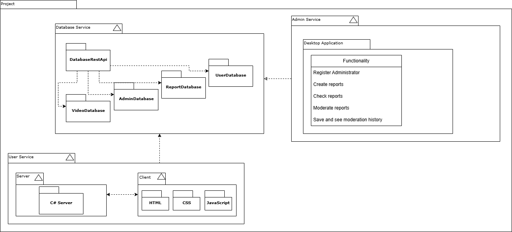

# Lab 2

Задачи скопированы в [TASKS.md](./TASKS.md)

## Task 1

Функционал описывался в [Лабораторной 1](../Lab1/README.md)

Мультисервисная структура, сервисы:

* Сервис базы данных
* Веб-клиент
* Декстопный клиент
* Сервис администрирования
* Сервис рекомендаций (Возможно)

Чтобы не распыляться на всё, в течение семестра я планирую сделать

* Сервис базы данных
* Пользовательский веб-клиент 
* Декстопный клиент для администрирования

### Сервис БД

Данный сервис будет маленьким и реализует лишь доступ к базам данных через некоторое API

#### Таблица с видео данными

| video_id | user_id | description | video_data | preview_data | banned |
|----------|---------|-------------|------------|--------------|--------|
| ...      | ...     | ...         | ...        | ...          | ...    |

#### Таблица с данными пользователя

| user_id | first_name | last_name | nickname   | password_hash | banned |
|---------|------------|-----------|------------|---------------|--------|
| ...     | ...        | ...       | ...        | ...           | ...    |

#### Таблица с данными администраторов

| user_id | first_name | last_name | nickname   | password_hash |
|---------|------------|-----------|------------|---------------|
| ...     | ...        | ...       | ...        | ...           |

#### Таблица с данными репортов

| report_id | user_id | video_id | description |
|-----------|---------|----------|-------------|
| ...       | ...     | ...      | ...         |

#### Таблица с данными репортов

| report_id | user_id | video_id | description | status |
|-----------|---------|----------|-------------|--------|
| ...       | ...     | ...      | ...         | ...    |

* `user_id` - id пользователя, который отправил репорт
* `video_id` - id видео, на которое отправили репорт
* `status` - статус рассмотрения репорта

#### Дополнительные структуры

DAO и DTO классы для каждой таблицы.

REST API для выполнения запросов.

### Пользовательский веб-клиент

Это веб-сайт, сервер будет на C#, сложных структур не планируется, клиент - HTML + CSS + JavaScript.

### Декстопный клиент для администрирования

Основное семестровое приложение.
Windows приложение, в котором можно будет выполнять работу администратора.
Требуемый функционал:

* Регистрация администратора
* Проверка доступных репортов
* Вынесение вердикта по репорту (бан видео, бан пользователя и тп)
* Заведение новых администраторских репортов
* Просмотр истории модерации

#### Классы

Классы-обертки над данными из сервиса базы данных:

> AdministratorData
> - user_id
> - first_name
> - last_name
> - nickname

> UserData
> - user_id
> - first_name
> - last_name
> - nickname
> - banned

> VideoData
> - video_id
> - user_id
> - description
> - video_data
> - preview_data
> - banned

> ReportData
> - report_id
> - user_id
> - video_id
> - description
> - status

Эти классы данных большие, поэтому создаем для них классы-строители (_паттерн **Строитель**_)

> AdministratorDataBuilder
> - SetFirstName()
> - SetLastName()
> - SetNickname()

> ReportData
> - SetUserId()
> - SetVideoId()
> - SetDescription()
> - SetStatus()

Эти классы будут получаться через класс-стратегию (для возможности тестирования, _паттерн **Стратегия**_)

> AdministratorDatabaseAPIStrategy
> - GetAdministrator()
> - CreateAdministrator()
> - RemoveAdministrator()
> - EditAdministrator()

> UserDatabaseAPIStrategy
> - GetUser()
> - BanUser()

> VideoDatabaseAPIStrategy
> - GetVideo()
> - BanVideo()

> ReportDatabaseAPIStrategy
> - GetReport()
> - CreateReport()
> - EditReport()

Фасад для хранения всех стратегий базы данных (_паттерн **Фасад**_)

> DatabaseAPIFacade
> - GetAdministrator()
> - CreateAdministrator()
> - RemoveAdministrator()
> - EditAdministrator()
> - GetUser()
> - BanUser()
> - GetVideo()
> - BanVideo()
> - GetReport()
> - CreateReport()
> - EditReport()

Классы-команды для возможности отмены действий администратора (_паттерн **Команда**_):

> IAdministratorCommand
> - Execute()
> - Undo()

И менеджер команд (_паттерн **Синглтон**_)

> CommandManagerSingleton
> - Execute()
> - Undo()

И абстрактная фабрика для возможности создания команд(_паттерн **Абстрактная фабрика**_)

> IAdministratorCommandFabric
> - СreateNewReportCommand()
> - СreateBanVideoCommand()

### UML диаграмма архитектуры



## Task 2

### Фрагмент 1

```c#
class DataOrg 
{ 
    string _name;
    int _nameLen; 

    public int Age { get; set; }
    public int Score { get; set; }


    public string[] GetStatement() 
    { 
        if (_name != null) 
        { 
            string[] row = new string[3]; 
            row[0] = _name; 
            row[1] = $"{Age * 0.83}"; 
            row[2] = DateTime.Now; 

            return row; 
        }

        return null; 
    } 

    public int UpdateNameLen() 
    { 
        if (_name == null) 
        { 
            return -1; 
        }
        else 
        { 
            if (_name.Length < 3) 
                return 0; 

            if (Age < 18 || Age > 65) 
                return 0; 

            if (Score == -1) 
                return 0; 

            _nameLen = _name.Length * 4; 
            
            return 0; 
        } 
    }
} 
```

### Фрагмент 2 (1 балл) 

```c#
public class GMethods 
{
    public string Name { get; private set; }

    private int _price; 
    private int _amount; 
    private string _platform; 

    public void PrintPack() 
    { 
        this.PrintBanner(); 

        // Print details. 
        Console.WriteLine("name: " + this.Name); 
        Console.WriteLine("amount: " + this.GetOutstanding()); 
        Console.WriteLine("price: " + this._price); 
        Console.WriteLine("platform: " + _platform); 
    } 

    float GetAmount() 
    { 
        if ((_platform.ToUpper().IndexOf("PC") > -1) && 
				(Name.ToUpper().IndexOf("XX") > -1) &&
				_amount > 0)
            return _amount * 0.956; 

        Console.WriteLine(_amount * _price); 
        Console.WriteLine(0.8 * _amount * _price); 

        return -1; 
    } 
}
``` 
 
### Фрагмент 3 (1 балл) 

```c#
class Fighter 
{
    private int _damage;

    public string SName { get; set; }
    public int FighterHealth { get; set; } 
    public int FighterDamage { get; set; } 
    public int WeaponStatus { get; set; } 

    void LogStatus(string name, int age, int health, int damage, int weaponStatus) 
    { 
        Console.WriteLine($"name:{name}, age:{age}, health:{health}, damage:{damage}, weaponStatus:{weaponStatus}"); 
    }

    public int GetDamage() 
    { 
        // WeaponStatus * 5 
        // Console.WriteLine($"Get Damage {_damage}"); 
        return _damage; 
    } 

    void AttackInner() 
    { 
        Console.WriteLine("Go Attack!"); 
        // TODO: implement attack 
    } 

    public void Attack() 
    { 
        try 
        { 
            AttackInner(); 
        } 
        catch(Exception e) 
        { 
            Console.WriteLine($"Go Attack Exception: {e}"); 
            throw e; 
        } 
    } 
}
```
