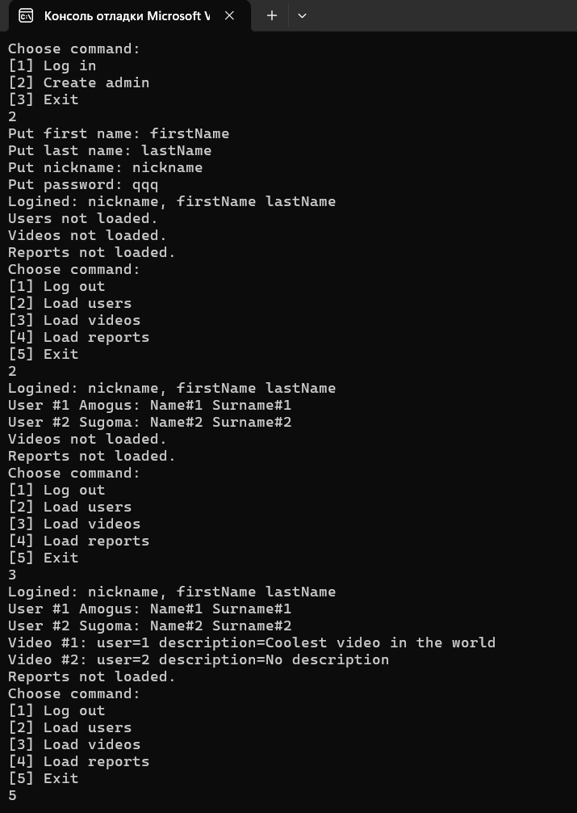

# Lab 4

Задачи скопированы в [TASKS.md](./TASKS.md)

## Task 1

Юнит тестирование реализуется для API базы данных, реализованные тесты:

* `TestAdministratorAPI` - тест регистрации админа в админке. Моки: `IAdministratorDatabaseAPIStrategy`

## Task 2

Реализовано простое консольное приложение, которое позволяет регистрироваться админу, и подгружать всех пользователей, все видео и все репорты.
Пока использоуется не реальная база данных.

### Пример работы программы

#### Уровень пользовательского интерфейса

Класс [Model](../Project/CSharpSemProject/CSharpSemProject/mvc/Model.cs)

#### Уровень доступа к данным

Классы в дирректории [api.impl](../Project/CSharpSemProject/CSharpSemProject/api/imp), реализации интерфейсов из доменного уровня

* `Null...` классы - это реализации интерфейсов, где каждый метод кидает ошибку `NotImplementedException()`
* `Local...` классы - это реализации для локального тестирования (т.к. интерфейсы - это API доступа к базам данным, то `Local...` классы - реализация этого API в локальной базе данных)

#### Доменный уровень

Интерфейсы доступа к API баз данных

* [IAdministratorDatabaseAPIStrategy](../Project/CSharpSemProject/CSharpSemProject/api/IAdministratorDatabaseAPIStrategy.cs)
* [IReportDatabaseAPIStrategy](../Project/CSharpSemProject/CSharpSemProject/api/IReportDatabaseAPIStrategy.cs)
* [IUserDatabaseAPIStrategy](../Project/CSharpSemProject/CSharpSemProject/api/IUserDatabaseAPIStrategy.cs)
* [IVideoDatabaseAPIStrategy](../Project/CSharpSemProject/CSharpSemProject/api/IVideoDatabaseAPIStrategy.cs)
