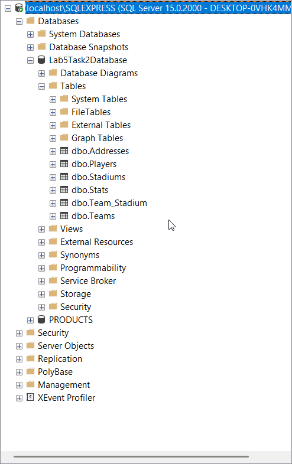

# Lab 5

## DI-контейнеры

### Singletone зависимости

<!-- Создается только один на всю область ответственности отдельно взятого компоновщика -->

* IAdministratorDatabaseAPIStrategy

### Scoped зависимости

<!-- Для каждого контеста создается только один инстанс -->

* IDatabaseAPIFacade

### Transient зависимости

<!-- Каждый раз новый инстанс зависимости строится -->

Следующие зависимости должны будут быть Singletone, когда мы будем работать с сетью,
но т.к. пока мы используем нулл-зависимости (и так же для демострации работы по домашнему заданию)
на их месте, их лучше сделать transient.

* IReportDatabaseAPIStrategy
* IUserDatabaseAPIStrategy
* IVideoDatabaseAPIStrategy

## Ado.Net лабораторная

Созданы таблицы `Adresses`, `Players`, `Stadiums`, `Stats`, `Team_Stadium`, `Teams`

Добавлены CRUD APIs: `PlayerAPI`, `AddressesAPI`, `StadiumsAPI`, `TeamsAPI`

Добалены отношения `Player-Address`(1-1), `Player-Team`(1-N), `Team-Stadium`(N-N) 

Добавлены транзакции в методы `TeamsAPI.Create(...)` и `PlayersAPI.Create(...)`
(То есть автоматическое добавление страницы со статистикой при создании команды и обновление среднего количество голов и кголичество игроков и добавлениии игрока)
