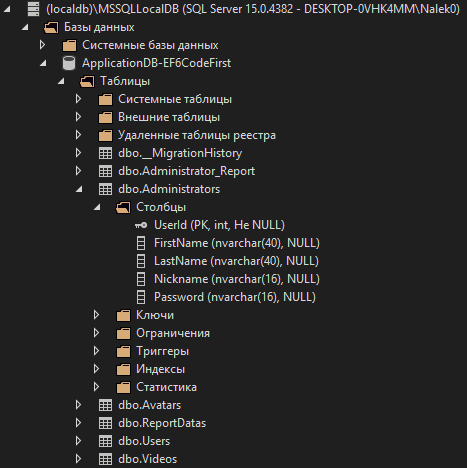

# Практика 6

## Entity Framework. Code First подход

### Задание A.

Добавлен Entity Framework 6 в проект.

Cоздана модель с таблицами `AdministratorData` `AvatarData`, `ReportData`, `UserData`, `VideoData`.

Создан контекст базы данных: `ApplicationDBContext`.

Инициализатор контекста: `ApplicationDBInitializer`.

Связи настроены с помощью Fluent API в `ApplicationDBInitializer.OnModelCreating`

### Задание B.

Можно увидеть на скриншоте созданную базу данных:

### Задание C.

TODO

### Задание D.

TODO

### Задание E.

TODO
